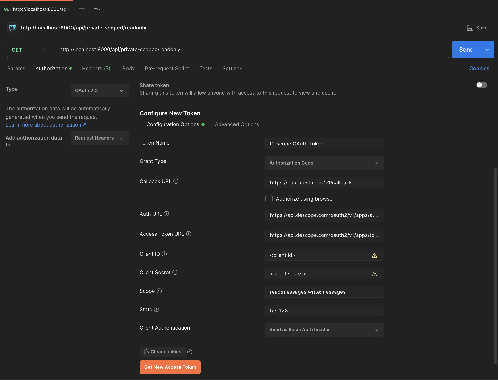

# Python FastAPI integration with Descope
This repository contains a Python FastAPI starter project for a backend server that demonstrates how to secure APIs using Descope authentication. It verifies JWT access tokens issued by Descope and enforces authorization for protected routes, including scope-based access control to restrict endpoints based on user permissions (e.g., read:messages, admin:write).

The implementation uses:
- PyJWT along with PyJWKClient for validating JWTs against Descope’s JWKS endpoint
- FastAPI’s Security dependency injection to enforce token validation and optional scope-based access control
- A custom TokenVerifier class for the token verification logic, including automatic key fetching and kid-based resolution

This starter is ideal for integrating Descope-authenticated clients (like web/mobile apps) with a secure Python FastAPI backend

## Setup
To setup this project locally, follow the steps below:
### 1. Clone the Repository
```bash
git clone https://github.com/descope-sample-apps/descope-fastapi-sample-app
cd descope-fastapi-sample-app
```
### 2. Create and Activate a Virtual Environment
```bash
python3 -m venv venv
source venv/bin/activate  # On Windows: venv\Scripts\activate
```
### 3. Install Dependencies
```bash
pip install -r requirements.txt
```
### 4. Configure Environment Variables
Create a .env file in the root directory of the project by copying the example file:
```bash
cp .env.example .env
```
Then, fill in the required environment variables:
- `DESCOPE_PROJECT_ID` — your Descope project ID, which you can get from https://app.descope.com/settings/project


## Starting the Server
This project uses [Uvicorn](https://www.uvicorn.org/) — a lightning-fast ASGI server — to run the FastAPI application.

To start the development server with auto-reload enabled:
```bash
uvicorn app.main:app --reload
```
Note: The `--reload` flag enables hot-reloading, so the server automatically restarts when you make code changes. This is recommended only for local development.

To verify that the server is up and running,  visit the following public test route in your browser: http://localhost:8000/api/public

## API Routes in this example app
To view all the API routes in this example, visit http://localhost:8000/docs.
1. `/api/public`: A public route, which does not require authentication
2. `/api/private`: A protected route, which requires a valid authentication token (JWT)
3. `/api/private-scoped/readonly`, `/api/private-scoped/write`, `/api/private-scoped/delete`, which are private, and also require the appropriate scopes (`read:messages`, `write:messages`, `delete:messages`) in the presented token.

## Calling the Server
To test your FastAPI endpoints, you can use tools like Postman or the terminal via curl.

### Using Postman
1. Open [Postman](https://www.postman.com/) and set the request URL to http://localhost:8000/<your route here>
2. To test authenticated routes (/private, /private-scoped/*), go to the Authorization tab, select 'Bearer Token' from the dropdown, and paste your JWT (access token) into the token field.

### Using curl
You can also directly use curl to test it on a terminal:

**Sample 'Readonly' Scope:**
```bash
curl -X 'GET' \
  'http://localhost:8000/api/private-scoped/readonly' \
  -H 'accept: application/json' \
  -H 'Authorization: Bearer <YOUR_TOKEN_WITH_SCOPES>'
```
**Sample 'Write' Scope**
```bash
curl -X 'GET' \
  'http://localhost:8000/api/private-scoped/write' \
  -H 'accept: application/json' \
  -H 'Authorization: Bearer <YOUR_TOKEN_WITH_SCOPES>'
```

## Testing the Authenticated Routes 
The application has 4 routes which require authentication:
- `/api/private`: Requires valid Authentication Token (no specific scopes)
- `/api/private-scoped/readonly`: Requires valid Token with scope `read:messages`
- `/api/private-scoped/write`: Requires valid Token with scope `write:messages`
- `/api/private-scoped/delete`: Requires valid Token with scope: `delete:messages`

If you open any of the above routes **without** providing an authorization token, you will receive a `401 Unauthorized` error.

If you open a scoped route without a token containing the required scope, you will receive a `403 Forbidden Error`, indicating the missing scopes.

**Note**:
The only difference between testing `/api/private` and the scoped routes is whether you include scopes when requesting the token. If you leave the Scope field empty, the token will authenticate successfully for `/api/private` but will be rejected for the scoped routes.

You can obtain a valid token for testing:

## Testing with [PostMan](https://www.postman.com/)
### Getting an Authorization Token
Before you test the private routes, you must have a valid Authorization Token. To fetch this token using Postman, follow the following steps:
1. Open [Postman](https://www.postman.com/), and in a new request tab, click the `Authorization` tab. 
2. Under Type, select **OAuth 2.0**. Scroll down to the Configure New Token section.In this tab, scroll down to the section on 'Configure New Token'
3. Fill in the following fields:
  - **Token Name**: any name to describe your token, e.g., 'Descope OAuth Token'
  - **Grant Type**: 'Authorization Code'
  - **Callback URL**: https://oauth.pstmn.io/v1/callback (to redirect back into Postman)
  - **Auth URL**: https://api.descope.com/oauth2/v1/authorize
  - **Access Token URL**: https://api.descope.com/oauth2/v1/token
  - **Client ID**: your [Descope Inbound App](https://app.descope.com/apps/inbound) Client ID
  - **Client Secret**: your [Descope Inbound App](https://app.descope.com/apps/inbound) Client Secret (**Note**: It's recommended to store this as a Postman secret)
  - **state**: any random string, e.g., 'test123'



5. If you are testing the scoped API routes, fill in **'Scope'** field with your desired scopes (`read:messages`, `write:messages`, `delete:messages`), as a **space-separated string**. If you are only testing `/api/private`, you can leave the Scope field empty.
6. Click **Get New Access Token**. A window will open, prompting you to authenticate.
7. After completing the login and granting consent, Postman will display the access token.
7. Click Use Token to attach the token to your request. You can now use this Authorization token for the private routes.

### Testing the Routes in Postman
1. In your request tab, set the method to GET.
2. Enter the URL of the route you want to test, for example: http://localhost:8000/api/private or http://localhost:8000/api/private-scoped/readonly
3. Ensure the Authorization Type is set to Bearer Token and that the token field contains your valid access token.
4. Click Send.

If the token is valid and contains the required scopes (for scoped routes), you will receive a 200 OK response with the protected resource or message.

